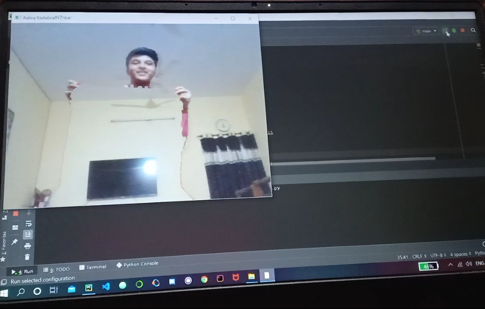

# Invisible_Cloak

It's a simple project you can have fun with! Just run the code in you favourite text editor. When a window opens with the video that's on the webcam, let it record for three seconds and just go in fromt of the cam with a red sheet (your invisibility cloak).

When you're done just click on esc to exit :)

